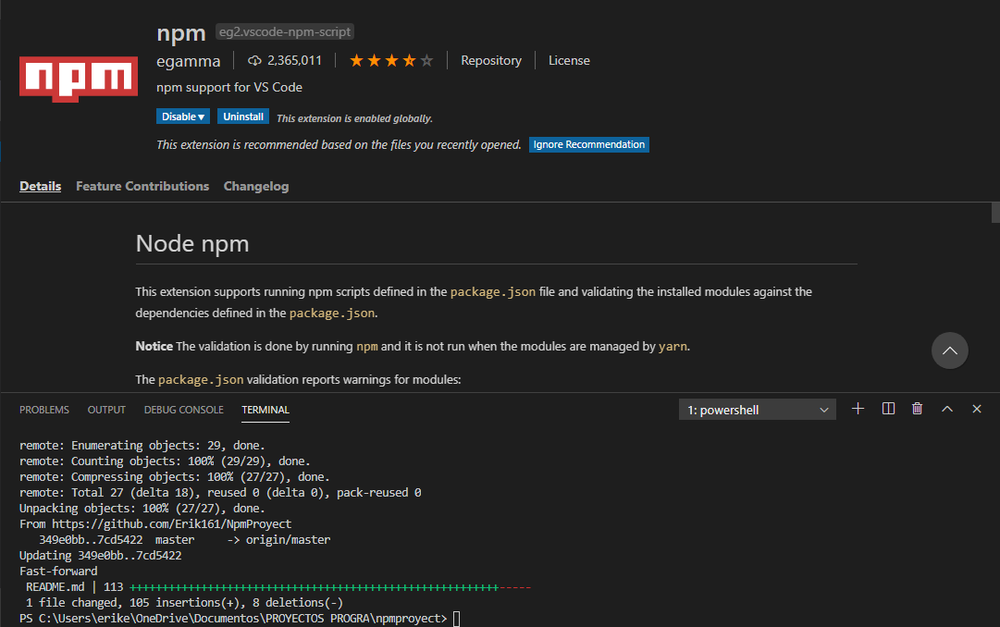

<p align="center"></p>


# [NPM](https://www.npmjs.com/)
```
¿Qué es NPM (node package manager)? 
Es un gestor de paquetes el mas popular que tiene javascript donde encontraras una gran cantidad de recursos
que podras inplementar en tus proyectos tambien vas a poder crear tus propios paquetes y compartirlos 
con toda la comunidad.

El cual se encarga de administrar todos estos paquetes tiene un sitio robusto donde tu vas a encontrar toda
esta información y tambien como desarrollador vas a poder crear estos paquetes aqui vas a poderlos publicar 
tener una serie de recursos para la comunidad puedan implementar con tus proyectos.

Encontraras un gran listado de recursos donde tu como desarrollador podras implementar en tus proyectos
desde librerias que son Open Source, hasta proyectos que nos van a dar vida a nuestras aplicaciones.

```

# INSTALACIÓN
```
Descarga Node.js ya te incluye una versión de NPM
```

### [NODE.JS](https://nodejs.org/es/)


<p align="center"></p>

```
Luego de la instalación debemos ingresar el siguiente comando para comprobar si existe una versión 
mas reciente de npm y si existe la va instalar en nuestro sistema nos va a garantizar que tengamos
la ultima versión.
```
> $ npm install -g npm@latest


# INICIAR NUESTRO PROYECTO

```
Ingresamos el siguiente comando:
```
> $ npm init

```
Nos permite crear el archivo package.json con el cual vamos a tener una configuración establecida una 
descripción del proyecto y ciertos valores que necesita.
```

<ul>  
<li>package name: (jsnpm)</li>
<li>version: (1.0.0)</li>
<li>description:Construir un paquete para node</li>
<li>entry point:(index.js) src/index.js</li>
<li>test command:</li>
<li>git repository:</li>
<li>keywords: javascript,node, package</li>
<li>author: Erik Hernandez <erikexamplehotmail.com></li>
<li>license: MIT</li>
</ul>


### INICIAR PROYECTO DE FORMA RAPIDA

```
No modificamos el Json hasta mas adelante, realiza un Json estatico,
ingresamos el siguiente comando en consola:
```
> $ npm init -y

### SIGUIENTE FORMA DE DECLARAR DE FORMA ESTATICA TU PROYECTO

```
Al ingresar estos comandos va añadir en la configuración de npm este valor, automaticamente establece 
estos valores a cada proyecto que tu inicialices de tu maquina vas a poder tener esta configuración 
guardada.
```
<ul>
 <li>npm set init.author.email "erikexample@hotmail.com"</li>
 <li>npm set init.author.name "Erik Hernandez"</li>
 <li>npm set init.license "MIT"</li>
</ul>

```
luego agregamos el siguiente comando para iniciar un nuevo proyecto ya con todos los valores automaticamente
los agrega:
```
> npm init -y


# COMO ES LA FORMA DE INSTALAR PAQUETES

```
Desde un paquete convencional hasta un paquete que es global o con todas las opciones que tenemos 
para instalar paquetes en nuetros proyectos.

Aqui es donde nostros vamos a instalar las dependencias son recursos que vamos a utilizar dentro de 
nuestros proyectos partiendo que hay una gran cantidad de estos recursos.
```
<ul>
<li>Crear una carpeta SRC y un archivo index.js para consumir los recursos que hemos instalados.</li> 
</ul> 

```
EJEMPLO:
npm install moment --save-dev

que significa --save?
que este documento que vas a instalar dentro del proyecto es necesario para vivir en produccion
entonces tenemos que tener cuidado cuando un paquete es a produccion y cuando no lo es.

Que significa -dev?
que este documento que vamos a instalar solo es necesario en nuestro entorno local o en el entorno de 
desarrollo partiendo de esta diferencia nosotros vamos a tomar desiciones cuando estemos instalando
las dependencias que requieren nuestro proyecto.

Porque es muy importante no mandar dependencias a produccion ni omitir unas que deban estar en 
produccion.
```
<ul>
  <li>La Carpeta node_modules Aqui es donde se van a descargar los modulos que estas instalando pero no debe ser 
enviada a ningun repositorio y debemos ingnorarla apenas se crea.
Como puedo ignorar esto?</li>
  <li>Creamos un nuevo archivo .gitignore y adentro colocamos node_modules/ con esto indicamos que toda esta
carpeta no debe ser mandada a ningun repositorio y obviamente a tu proyecto de produccion.</li>
</ul>  

```
Otra forma de trabajar con npm fluidamente es resumir install, --save -dev y lo hacemos de la siguiente manera:
```
> npm i date-fns -D

> npm i moment -S

```
En algun momento vas a necesitar que un paquete corra de forma global, uno de los principales proyectos 
que se instala de forma global se llama nodemon, nos permite generar un demonio que se va encargar de 
estar siempre escuchando algun cambio algun valor va dejar y mantener nuestro proceso algun comando 
que estemos ejecutando de node:
```
> npm install -g nodemon


```
El siguiente comando se utiliza para listar todos los recursos que estan instalados de forma global en npm:
```
> npm list -g --depth 0

```
Para distinguir que una dependencia no va hacer instalada dentro del proyecto pero si queremos ver el outpout
que nos retorna: --dry-run

Lo unico que va a relizar es simular que se instala nos da el outpud de lo que esta sucediendo y tu tomas la
desicion si lo vas a ejecutar si o no en tu proyecto.

```
> npm install react --dry-run

```
Hay otra forma de instalar paquetes y es con Force el cual nos va permitir instalar este paquete forzando 
esa instalacion a que sea el ultimo recurso desde el servidor de NPM se agrega como una dependencia y lo 
ejecutamos de la siguiente manera:
```
> npm install webpack -force

```
Podemos editar manualmente nuestros recursos agregarlo en dependencias, Devdependencias, optionalDependencies,
y si hemos echo esto lo ideal seria volver hacer una instalacion completa y para esto podemos correr 
el comando: NPM INSTALL

Este comando lo que hace es revisar el archivo de PACKAGE.JSON y lo que hace es volver a instalar cada una 
de estas dependencias que estan, no importa si estan en desarrollo no importa si estan en las opcionales 
o en las dependencias que requiera tu proyecto lo que hace es instalar todo lo que se encuentre en el archivo
PACKAGE.JSON
```
>npm install

```
Una ultima forma para instalar una dependencia y un paquete de una version particular que voy a utilizar
agregamos lo siguiente: @0.15.0
```
>nm install json-server@0.15.0


# ACTUALIZAR Y ELIMINAR PAQUETES

```
Forma de darnos cuenta que existen actualizaciones en nuestros paquetes, el siguiente comando lo que hace es
listar los paquetes que tenemos en nuestro proyecto NPM LIST
```
> npm list

```
Forma de de ver que paquetes puedan llegar a estar desactualizados NPM OUTDATE
```
>npm outdate

```
Si nosotros queremos ver todo lo que esta sucediendo atras de NPM, nos va a permitir que esta sucediendo
todo ese script que corre detras de nuestra maquina tiene todo un funcionamiento como trae la informacion
asi como la secion que estamos utilizando y donde se encuentran ciertas configuraciones de nuestro
proyecto. --DD para ver un outpout mas detallado.
```
>npm outdate --dd

```
Con el siguiente comando realizamos updadate de los paquetes que no esten en esa version, 
lo que hace es actualizar
los paquetes a la ultima version. NPM UPDATE.
```
> npm update

```
Forma de actualizar un paquete en particular con el siguiente comando: LATEST
```
> npm install json-server@latest

```
Como voy a desinstalar los paquetes con el siguiente comando: NPM UNINSTALL
```
> npm uninstall json-server

```
Forma de eliminar un paquete pero sin eliminarlo de package.json con el siguiente comando: 
NPM UNINSTALL   --NO-SAVE
de esta forma vamos a desinstalarlo de todo lo que seria node_modules pero no en nuestro
archivo de package.json.
```
> npm uninstall webpack --no-save

```
NPM para VISUAL STUDIO CODE, analiza tu archivo de packaje.json y lo compara contra 
la carpeta de node_modules y te avisa si uno de estos paquetes no esta instalados
```




